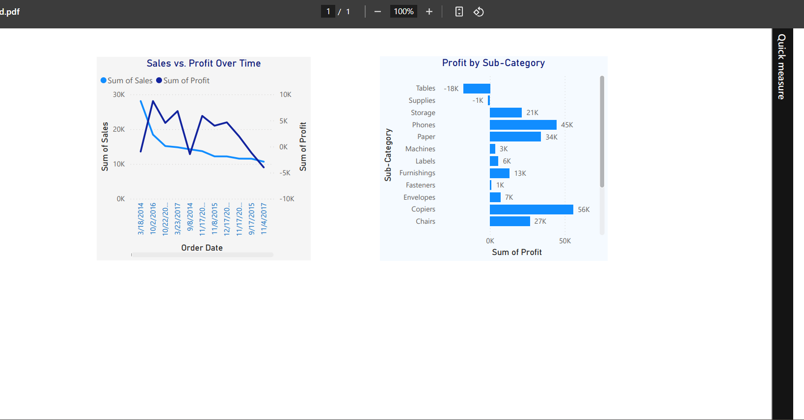

#  Sales & Profit Analysis – Power BI

This project visualizes key business insights using sales data from a retail store.  
Created as part of a Data Analyst internship task focused on **data visualization and storytelling**.

##  Dashboard Overview

The Power BI report includes:

1. **Sales vs. Profit Over Time**  
   A line chart comparing how sales and profit evolved monthly.

2. **Profit by Product Sub-Category**  
   A bar chart highlighting which categories bring the most (or least) profit.

##  Report Preview

##  Tools Used

- **Power BI Desktop**
- Sample Superstore dataset (`Superstore.csv`)

##  Files Included

| File | Description |
|------|-------------|
| `pbi_data_visuals.pbix` | Main Power BI report file |
| `Superstore.csv` | Cleaned dataset used |
| `screenshots/report-preview.png` | Dashboard screenshot |

##  How to Use

1. Clone this repository
2. Open the `.pbix` file in Power BI Desktop
3. Explore and interact with the visuals
4. Modify or extend as needed

###  Contact

Created by Vanshika Verma

